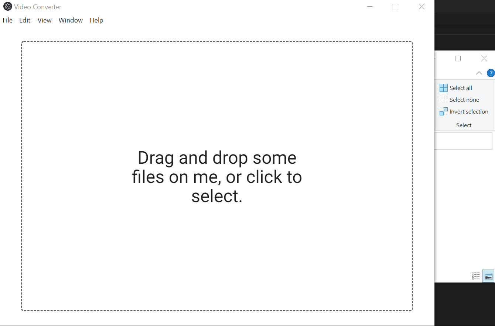

# Getting started

A cross-platform (can run on both Windows and macOS) app allowing users to convert one or a list of video files into other file formats. For example, the app can convert `.mp4` to `.avi` or `.mpeg`.

## To run the app

* Install dependencies:
`npm install`

* Start webpack-dev server:
`npm start`

* In a new terminal window:
`npm run electron`

## App Snapshot

